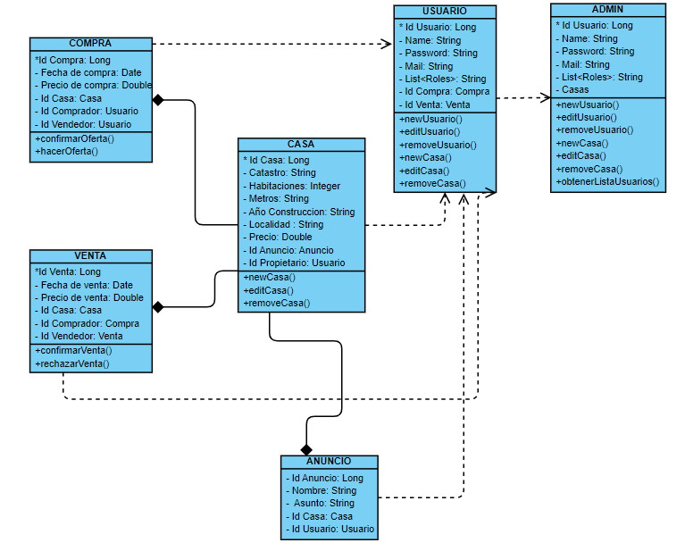
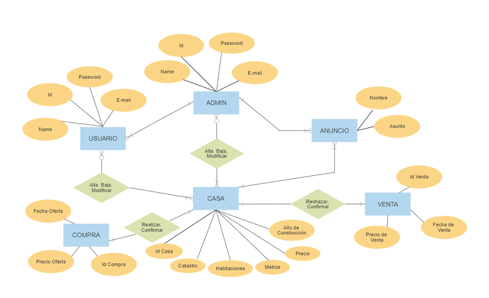
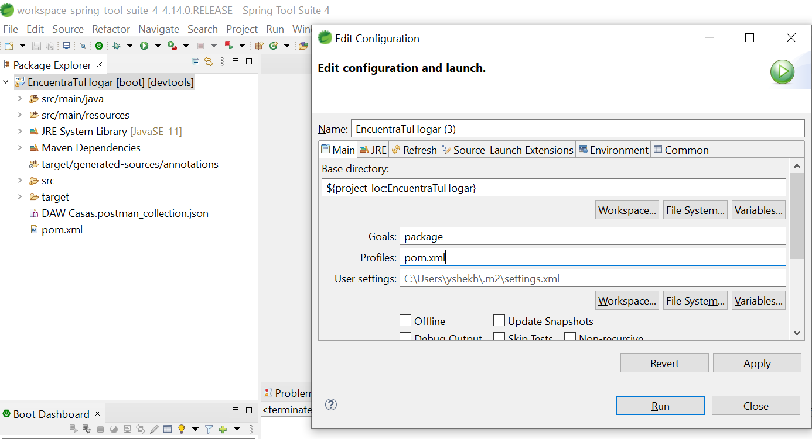
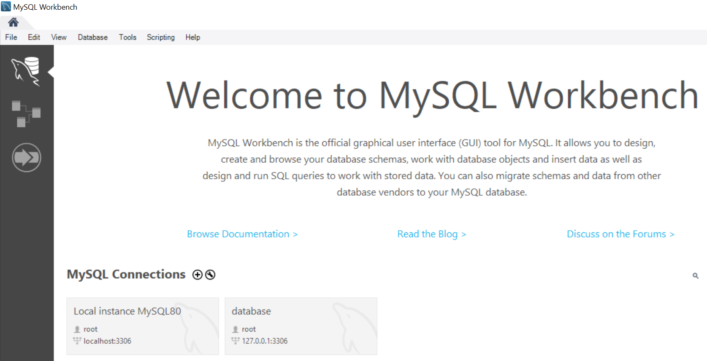
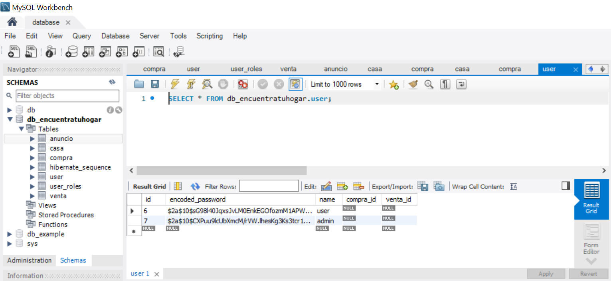
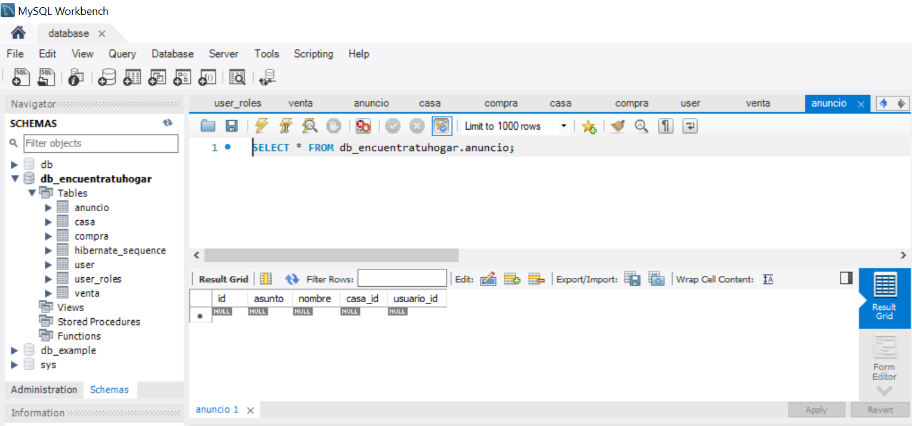
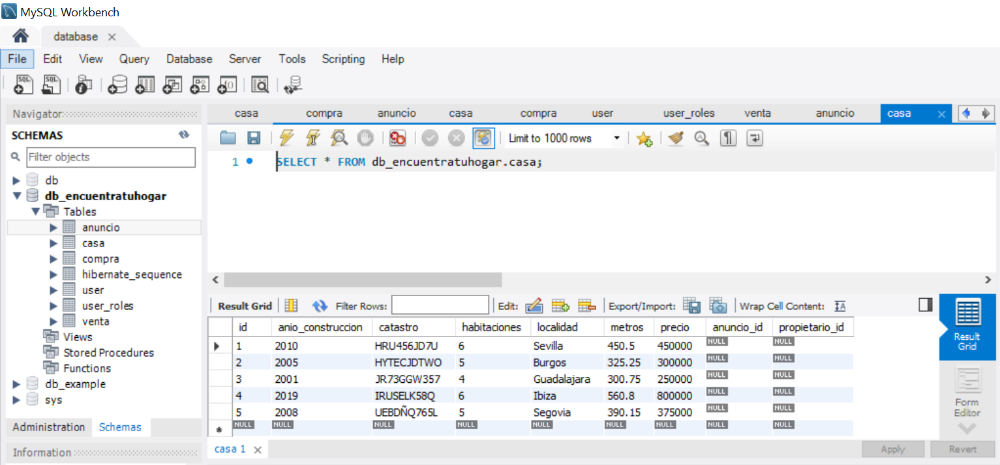
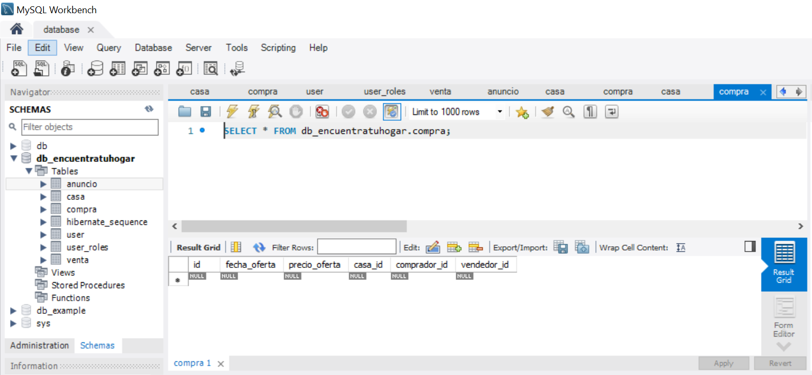
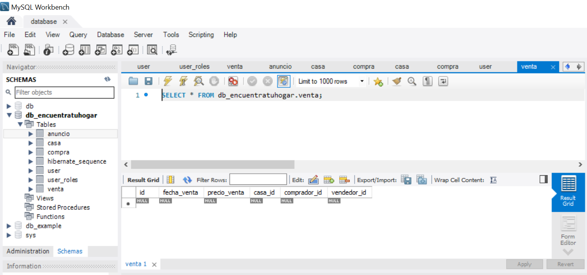
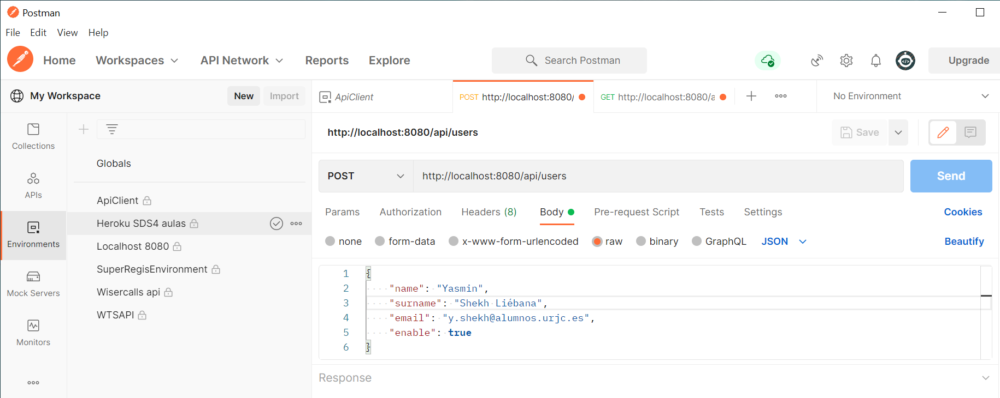

# EncuentraTuHogar
# Fase 1
Aplicación Web de compra/venta de casas.

Descripción lógica de las entidades:
- Administrador
   - Esta entidad almacena los datos de los usuarios gestionando su alta y baja del sistema.
- Usuario
   - Esta entidad posee los datos relevantes que debe poseer un usuario registrado en el sistema para poder realizar una compra o una venta de una casa.
- Compra
   - Almacena los datos que tienen relación con la compra de una casa.
- Venta
   - Almacena los datos que tienen relación con la venta de una casa.
- Casa
   - Almacena los datos que tiene relación con todas las casas.

Integrante:  
Nombre: Yasmin  
Apellidos: Shekh Liébana  
E-mail: y.shekh@alumnos.urjc.es  
Git: https://github.com/yasminsd/EncuentraTuHogar   
Tablero Trello: https://trello.com/encuentra_tu_hogar 

# Fase 2
Diagrama de clases UML  
  
Diagrama Entidad/Relación  
  
Instruciones específicas para desplejar la aplicación:
- Los requisitos para ejecutar la aplicación son :
   - Java 11  
   - OpenJDK Java 11  
   - MySQL 8.0  
- Los datos para iniciar la aplicación son:
   -  Rol Usuario: user@user.com pass
   -  Rol Admin: admin@admin.com adminpass  

Para generar el ejecutable jar es necesario compilarlo. Para ello:  
- Seleccionamos Run As en nuestro proyecto y a continuación Maven Buid. Debemos especificar en el campo Goals "package" y se generará un archivo jar:    
  

Ejecutamos el archivo jar ubicado en la carpeta target de nuestro proyecto y la aplicación entrará en funcionamiento.  
  
Para comprobar que la base de datos MySQL se ha conectado con Spring Boot he utilizado la aplicación MySQL Workbench versión 8.0:   
   
Con esta aplicación, he comprobado si la aplicación Spring Boot se conectaba o no a la basae de datos de MySQL visualizando las tablas generadas:  
Tabla Usuario  

  
Tabla Anuncio  

  
Tabla Casa  

  
Tabla Compra  

  
Tabla Venta  

  

Otra herramienta que he utilizado, sobre todo al principio, es Postman con la que podemos realizar las operaciones CRUD (Crear,Leer, Actualizar y Borrar) sobre las bases de datos relacionales y comprobar si los métodos están realizados correctamente.   

  

# Fase 3
En esta última fase vamos a utilizar balanceadores de carga para que pueda tener múltiples servidores.
El balanceador de carga va a estar escuchando en una IP en el puerto 80.

Para realizar el despliegue de la aplicación vamos a utilizar una máquina virtual. 
La idea es levantar los siguientes procesos: 
- Una instancia del balanceador de carga (HAproxy) 
- Dos instancias de la aplicación web 
- La base de datos 
 

